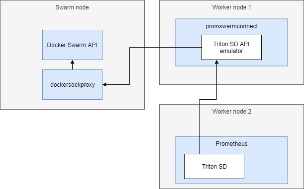

[](https://hub.docker.com/r/fn61/promswarmconnect/)


IMPORTANT NOTICE
----------------

[Prometheus recently added native Swarm support](https://prometheus.io/docs/guides/dockerswarm/)

For more details see [Issue #14](https://github.com/function61/promswarmconnect/issues/14)


What?
-----

Syncs services/tasks from Docker Swarm to Prometheus by pretending to be a Triton service
discovery endpoint, which is a
[built-in service discovery module](https://github.com/prometheus/prometheus/tree/master/discovery/triton)
in Prometheus.

Features:

- Have your container metrics scraped fully automatically to Prometheus.
- We don't have to make ANY changes to Prometheus (or its container) to support Docker
  Swarm (except configuration changes).
- Supports overriding metrics endpoint (default `/metrics`) and port.
- Supports clustering, so containers are discovered from all nodes. Neither Prometheus
  nor promswarmconnect needs to run on the Swarm manager node.
    * promswarmconnect needs to run on Swarm manager if you use the `docker.sock` mount option
- Supports scoping Prometheus `job` label to a) container (default), b) host (think host-level
  metrics) or c) static string (think cluster-wide metrics).
  [Read more](https://github.com/function61/promswarmconnect/blob/ecc947d4aa6b29bb4595929d2bc23b1ec7bd5e9e/cmd/promswarmconnect/main.go#L173)



NOTE: the drawing is for option 2). This is even simpler if you use option 1) with socket mount.


How to deploy
-------------

Run the image from Docker Hub (see top of README) with the configuration mentioned below.
Both options mention "VERSION" version of the image. You'll find the latest version from
the Docker Hub. We don't currently publish "latest" tag so the versions are immutable.

You need to run promswarmconnect and Prometheus on the same network.

### Option 1: run on Swarm manager node with mounted `docker.sock`

This is the easiest option, but requires you to have a placement constraint to guarantee
that promswarmconnect always runs on the manager node - its Docker socket is the only API
with knowledge of the whole cluster state.

```console
$ docker service create \
	--name promswarmconnect \
	--constraint node.role==manager \
	--mount type=bind,src=/var/run/docker.sock,dst=/var/run/docker.sock \
	--env "DOCKER_URL=unix:///var/run/docker.sock" \
	--env "NETWORK_NAME=yourNetwork" \
	--network yourNetwork \
	"fn61/promswarmconnect:VERSION"
```

NOTE: `unix:..` contains three forward slashes!


### Option 2: run on any node by having Docker's socket exposed over HTTPS

This may be useful to you if you have other needs that also require you to expose Docker's
port. For example I'm running [Portainer](https://www.portainer.io/) on my own computer
and that needs to dial to Docker's socket over TLS from the outside world.

Docker's socket needs to be exposed over HTTPS with a client cert authentication. We use
[dockersockproxy](https://github.com/function61/dockersockproxy) for this. You can do the
same with just pure Docker (expose the API over HTTPS) configuration, but I found it much
easier to not mess with default Docker settings, and to do this by just deploying a container.

Below configuration `DOCKER_CLIENTCERT` (and its key) refers to the client cert that is allowed to
connect to the Docker socket over HTTPS. They can be encoded to base64 like this:

- `$ cat cert.pem | base64 -w 0`
- `$ cat cert.key | base64 -w 0`

```console
$ docker service create \
	--name promswarmconnect \
	--env "DOCKER_URL=https://dockersockproxy:4431" \
	--env "DOCKER_CLIENTCERT=..." \
	--env "DOCKER_CLIENTCERT_KEY=..." \
	--env "NETWORK_NAME=yourNetwork" \
	--network yourNetwork \
	"fn61/promswarmconnect:VERSION"
```

Obviously, you need to replace URL and port with your Docker socket's details.

### Verify that it's working

Before moving on to configure Prometheus, verify that promswarmconnect is working.

Grab an Alpine container (on the same network), and verify that you can `$ curl` the API:

```console
$ docker run --rm -it --network yourNetwork alpine sh
$ apk add curl
$ curl -k https://promswarmconnect/v1/discover
{
  "containers": [
    {
      "server_uuid": "/metrics",
      "vm_alias": "10.0.1.7:8081",
      "vm_brand": "http",
      "vm_image_uuid": "traefik_traefik",
      "vm_uuid": "rsvltiqm6nbcj72ibi7bess0w"
    },
    {
      "server_uuid": "/metrics",                 <-- __metrics_path__
      "vm_alias": "10.0.1.15:80",                <-- __address__
      "vm_brand": "http",                        <-- __scheme__
      "vm_image_uuid": "hellohttp_hellohttp",    <-- job (Docker service name)
      "vm_uuid": "p44b6yr05ucmhpl0teiadq3jt"     <-- instance (Docker task ID)
    }
  ]
}
```

[More info here](https://github.com/function61/promswarmconnect/blob/ecc947d4aa6b29bb4595929d2bc23b1ec7bd5e9e/cmd/promswarmconnect/main.go#L207)
on why the JSON keys are so different W.R.T. Prometheus labels they'll be relabeled at
(see also our config example).


Running in a swarm via docker-compose
----------------------------------------

You can launch promswarmconnect via docker-compose, an entry would look similar to the below for the promswarmconnect container.
```yaml
promswarmconnect:
    image: fn61/promswarmconnect:20190126_1620_7b450c47
    volumes:
      - /var/run/docker.sock:/var/run/docker.sock
    environment:
      - DOCKER_URL=unix:///var/run/docker.sock
      - NETWORK_NAME=<CHANGETOSTACKNETNAME>
    deploy:
      placement:
        constraints: [node.role == manager]

```

Then for each service you wish to monitor metrics for, add an environment var as noted above in this readme, for example:
```yaml
nats_monitoring:
    image: ainsey11/nats_prometheus_exporter
    environment:
      - METRICS_ENDPOINT=:7777/metrics
    ports:
      - 7777:7777
    command: ["-varz", "-connz", "-routez", "-subz", "http://nats:8222"]

```

Exporting per node metrics via multiple containers in a service
--------------------------------------------------------------

The prime use case of this is when running something like node_exporter, or cAdvisor as a service with a global constraint
basically, each docker host will have a cAdvisor container running, the problem with this is that by default promswarmconnect doesn't return by default, the hostname of the host the container is on
this makes it difficult to differentiate which container is which when the data is surfaced into prometheus itself,

as described in Issue Number 4, you can edit the environment variable of the container you wish to autodiscover, as follows:
``` METRICS_ENDPOINT=/metrics,instance=_HOSTNAME_ ```

this will then return a value similar to:

```json
    {
      "server_uuid": "/metrics",
      "vm_alias": "10.0.3.86:8080",
      "vm_brand": "http",
      "vm_image_uuid": "test_stack1_cadvisor",
      "vm_uuid": "nc-docker-1"
    },

```


Configuring Prometheus
----------------------

Configure your Prometheus:
[example configuration that works for us](https://github.com/function61/prometheus-conf/blob/e5c70f03674a87f1b1ffed9555f8386a7a84b758/prometheus.yml#L14).

**The relabeling steps are really important**

The `endpoint` needs to be your service name in Docker that you use to run promswarmconnect.

Pro-tip: you could probably use
[our Prometheus image](https://github.com/function61/prometheus-conf) (check the Docker
Hub link) as-is, if not for production but at least to check out if this concept works for
you!


Considerations for running containers
-------------------------------------

promswarmconnect only picks up containers whose *service-level ENV vars* specify
`METRICS_ENDPOINT=/metrics`. To use non-80 port, specify `METRICS_ENDPOINT=:8080/metrics`.
The metrics path is also configurable, obviously.

For a complete demo with dummy application, deploy:

- promswarmconnect (instructions were at this document)
- our prometheus image (instructions were at above pro-tip) and
- [hellohttp](https://github.com/joonas-fi/hellohttp) (it has built-in Prometheus metrics)


FAQ
---

> Can I read `DOCKER_CLIENTCERT` or `DOCKER_CLIENTCERT_KEY` from file or use Docker secrets?

Yes, see [#10](https://github.com/function61/promswarmconnect/issues/10)

> TLS?

See [#12](https://github.com/function61/promswarmconnect/issues/12#issuecomment-664344435)


How to build & develop
----------------------

[How to build & develop](https://github.com/function61/turbobob/blob/master/docs/external-how-to-build-and-dev.md)
(with Turbo Bob, our build tool). It's easy and simple!


Alternatives & links
--------------------

- https://github.com/ContainerSolutions/prometheus-swarm-discovery
- https://github.com/prometheus/prometheus/issues/1766
- https://github.com/jmendiara/prometheus-swarm-discovery
